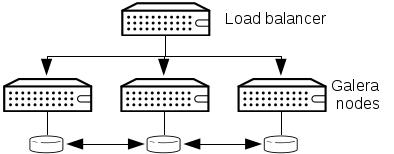

Introduction
------------

MariaDB with Galera provides synchronous database replication, in an active-active, multi-master environment. High availability for the data itself is managed internally by Galera, while access availability is managed by HAProxy.

It is important to note that, while Galera supports multi-master access, there are known issues in an OpenStack environment due to its use of optimistic locking (see [this post](http://lists.openstack.org/pipermail/openstack-dev/2014-May/035264.html) for details). Due to this limitation, the HAProxy configuration used for Galera sets a single node to be accessed at all times, and a different node will only be used when the original node fails. This effectively turns the Galera configuration into an active-hot standby one.

The following commands will be executed on all controller nodes, unless otherwise stated.

Install software
----------------

    yum install -y mariadb-galera-server xinetd rsync

Configure cluster check
-----------------------

    cat > /etc/sysconfig/clustercheck << EOF
    MYSQL_USERNAME="clustercheck"
    MYSQL_PASSWORD="redhat"
    MYSQL_HOST="localhost"
    MYSQL_PORT="3306"
    EOF

Start mysqld and create user for cluster check
----------------------------------------------

    systemctl start mysqld
    mysql -e "CREATE USER 'clustercheck'@'localhost' IDENTIFIED BY 'redhat';"
    systemctl stop mysqld

Create Galera configuration
---------------------------

    cat > /etc/my.cnf.d/galera.cnf << EOF
    [mysqld]
    skip-name-resolve=1
    binlog_format=ROW
    default-storage-engine=innodb
    innodb_autoinc_lock_mode=2
    innodb_locks_unsafe_for_binlog=1
    max_connections=2048
    query_cache_size=0
    query_cache_type=0
    bind_address=192.168.1.22X
    wsrep_provider=/usr/lib64/galera/libgalera_smm.so
    wsrep_cluster_name="galera_cluster"
    wsrep_cluster_address="gcomm://192.168.1.221,192.168.1.222,192.168.1.223"
    wsrep_slave_threads=1
    wsrep_certify_nonPK=1
    wsrep_max_ws_rows=131072
    wsrep_max_ws_size=1073741824
    wsrep_debug=0
    wsrep_convert_LOCK_to_trx=0
    wsrep_retry_autocommit=1
    wsrep_auto_increment_control=1
    wsrep_drupal_282555_workaround=0
    wsrep_causal_reads=0
    wsrep_notify_cmd=
    wsrep_sst_method=rsync
    EOF

Create Galera systemd configuration file, to allow a higher number of files to be opened
----------------------------------------------------------------------------------------

    mkdir -p /etc/systemd/system/mariadb.service.d/
    cat > /etc/systemd/system/mariadb.service.d/limits.conf << EOF
    [Service]
    LimitNOFILE=16384
    EOF

Configure monitor service (used by HAProxy)
-------------------------------------------

    cat > /etc/xinetd.d/galera-monitor << EOF
    service galera-monitor
    {
        port = 9200
        disable = no
        socket_type = stream
        protocol = tcp
        wait = no
        user = root
        group = root
        groups = yes
        server = /usr/bin/clustercheck
        type = UNLISTED
        per_source = UNLIMITED
        log_on_success = 
        log_on_failure = HOST
        flags = REUSE
    }
    EOF

Start services and open firewall ports
--------------------------------------

    systemctl daemon-reload
    systemctl enable xinetd
    systemctl start xinetd
    systemctl enable haproxy
    systemctl start haproxy

    firewall-cmd --add-service=mysql
    firewall-cmd --add-port=4444/tcp 
    firewall-cmd --add-port=4567/tcp
    firewall-cmd --add-port=4568/tcp
    firewall-cmd --add-port=4568/tcp --permanent
    firewall-cmd --add-service=mysql --permanent
    firewall-cmd --add-port=4567/tcp --permanent
    firewall-cmd --add-port=4444/tcp --permanent
    firewall-cmd --add-port=9300/tcp
    firewall-cmd --add-port=9300/tcp --permanent
    firewall-cmd --add-port=9200/tcp
    firewall-cmd --add-port=9200/tcp --permanent

Start mariadb cluster
---------------------

**On all nodes:**

    systemctl enable mariadb

**On node1:** 

    sudo -u mysql /usr/libexec/mysqld --wsrep-cluster-address='gcomm://' &

**On node2 and node3:**

    systemctl start mariadb

 Once clustecheck returns 200 on all nodes, restart galera on node 1:

    kill <mysql PIDs>
    systemctl start mariadb

Create users and databases
--------------------------

**On node 1:**

    mysql

    MariaDB [(none)]> use mysql;
    MariaDB [mysql]> drop user ''@'hacontroller1.example.com';
    MariaDB [mysql]> drop user 'root'@'hacontroller1.example.com';
    MariaDB [mysql]> GRANT ALL PRIVILEGES ON *.* TO 'root'@'%' IDENTIFIED by 'mysqltest' WITH GRANT OPTION;
    MariaDB [mysql]> CREATE DATABASE keystone;
    MariaDB [mysql]> GRANT ALL ON keystone.* TO 'keystone'@'%' IDENTIFIED BY 'keystonetest';
    MariaDB [mysql]> CREATE DATABASE glance;
    MariaDB [mysql]> GRANT ALL ON glance.* TO 'glance'@'%' IDENTIFIED BY 'glancetest';
    MariaDB [mysql]> CREATE DATABASE cinder;
    MariaDB [mysql]> GRANT ALL ON cinder.* TO 'cinder'@'%' IDENTIFIED BY 'cindertest';
    MariaDB [mysql]> CREATE DATABASE neutron;
    MariaDB [mysql]> GRANT ALL ON neutron.* TO 'neutron'@'%' IDENTIFIED BY 'neutrontest';
    MariaDB [mysql]> CREATE DATABASE nova;
    MariaDB [mysql]> GRANT ALL ON nova.* TO 'nova'@'%' IDENTIFIED BY 'novatest';
    MariaDB [mysql]> CREATE DATABASE heat;
    MariaDB [mysql]> GRANT ALL ON heat.* TO 'heat'@'%' IDENTIFIED BY 'heattest';
    MariaDB [mysql]> FLUSH PRIVILEGES;
    MariaDB [mysql]> quit

    mysqladmin flush-hosts
