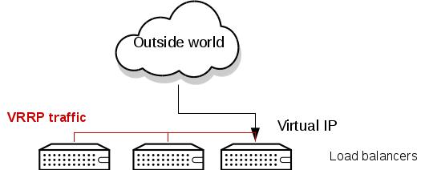

Introduction
------------

[Keepalived](http://www.keepalived.org/) provides simple and robust facilities for load balancing and high-availability to Linux system and Linux based infrastructures. In this highly available OpenStack architecture, it is used to provide high availability to the virtual IP(s) used by HAProxy. High-availability is achieved by VRRP protocol, a fundamental brick for router failover.

The following commands will be executed on all controller nodes, unless otherwise stated.

You can find a phd scenario file [here](phd-setup/keepalived.scenario).

Install software
----------------

    yum -y install keepalived psmisc

Create configuration file
-------------------------

On all nodes:

    cat > /etc/keepalived/keepalived.conf << EOF

    vrrp_script chk_haproxy {
        script "/usr/bin/killall -0 haproxy"
        interval 2
    }

    vrrp_instance VI_PUBLIC {
        interface eth1
        state BACKUP
        virtual_router_id 52
        priority 101
        virtual_ipaddress {
            192.168.1.220 dev eth1
        }
        track_script {
            chk_haproxy
        }
        # Avoid failback
        nopreempt
    }

    vrrp_sync_group VG1
        group {
            VI_PUBLIC
        }
    EOF

Open firewall rules and start services
--------------------------------------

On all nodes:

    firewall-cmd --direct --add-rule ipv4 filter INPUT 0 -i eth1 -d 224.0.0.0/8 -j ACCEPT
    firewall-cmd --direct --perm --add-rule ipv4 filter INPUT 0 -i eth1 -d 224.0.0.0/8 -j ACCEPT
    systemctl start keepalived
    systemctl enable keepalived
